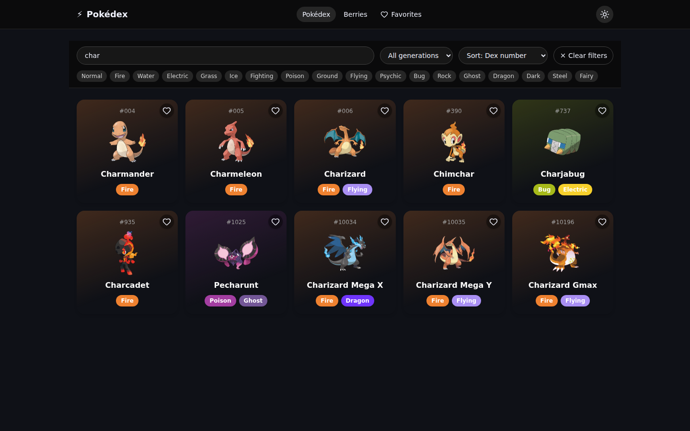
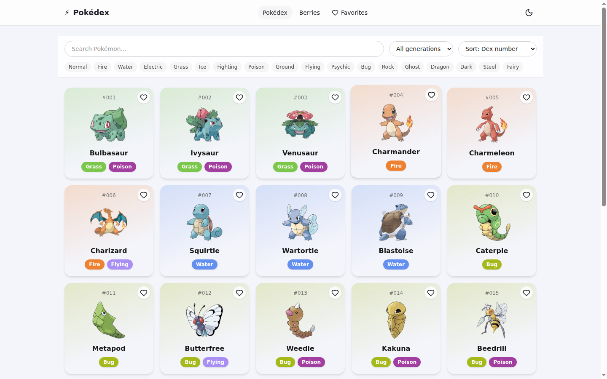
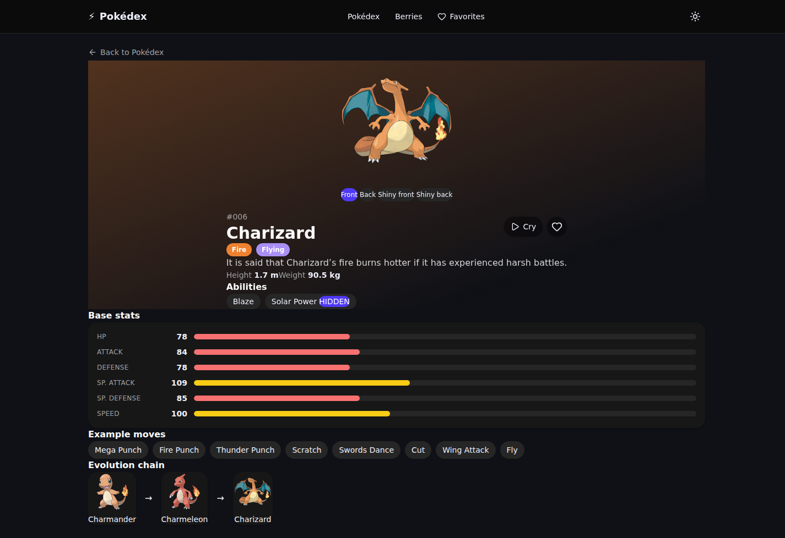
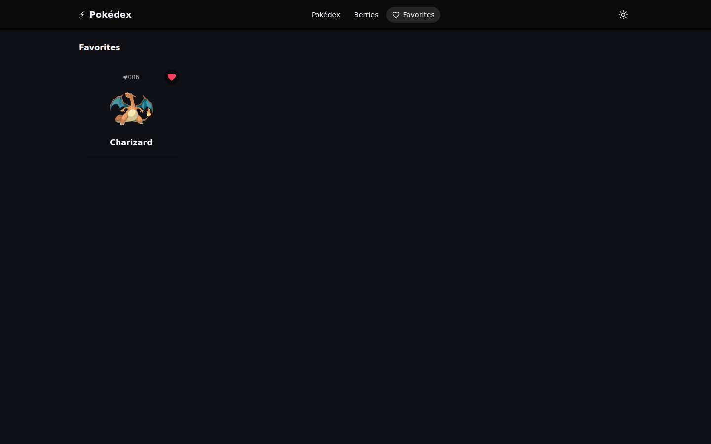
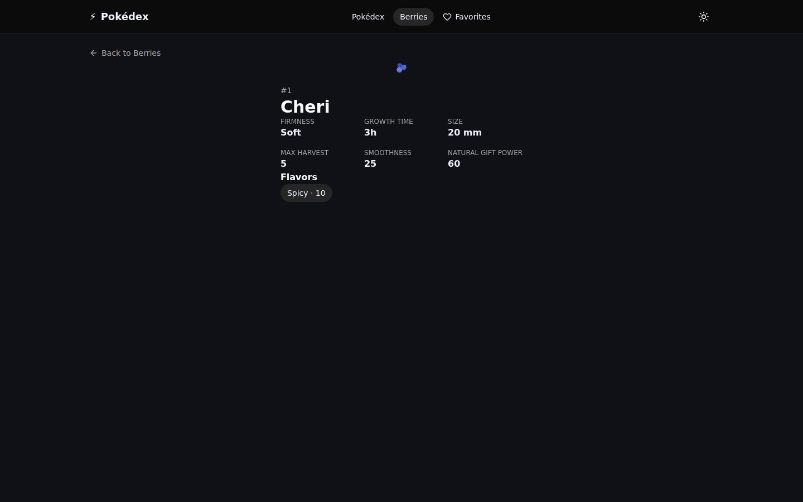
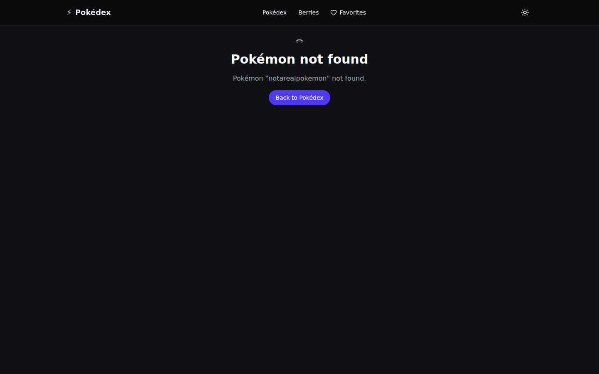

# ⚡ Pokédex

A polished, animated Pokédex web app built with SvelteKit 5 and Tailwind CSS v4, powered entirely by the public [PokeAPI](https://pokeapi.co/api/v2).

**🔗 Live demo: [azagatti.github.io/pokedex-sum-sm2](https://azagatti.github.io/pokedex-sum-sm2/)**

[](https://github.com/AZagatti/pokedex-sum-sm2/actions/workflows/deploy.yml)    



## Features

- **Browse** every Pokémon in a responsive, type-colored card grid with infinite scroll (IntersectionObserver, 30 per page) and shimmer skeleton loaders.
- **Search** by name (debounced), **filter** by generation (1–9) and/or type (multi-select, all 18 types), **sort** by dex number or base-stat total, with a one-click "clear filters."
- **Detail pages** with animated entrance, large official artwork, type badges, height/weight, animated base-stat bars, abilities (hidden abilities tagged), example moves, a full evolution chain, a front/back/shiny sprite switcher, and a play-cry audio button.
- **Berries**: a full list and detail pages (firmness, flavors, growth time, size, and more) in the same visual language.
- **Favorites**: heart any Pokémon from a card or its detail page; favorites persist to `localStorage` and have their own page.
- **Dark / light theme**, persisted and applied before hydration to avoid a flash of the wrong theme.
- Fully **accessible**: labeled controls, visible focus states, keyboard navigation, alt text, and `prefers-reduced-motion` support throughout.
- Custom **404** and error states everywhere data can fail to load.

## Tech stack

| Layer | Choice |
| --- | --- |
| Framework | [SvelteKit](https://svelte.dev/docs/kit) (Svelte 5 runes) + TypeScript (strict) |
| Deployment target | `@sveltejs/adapter-static` (SPA fallback) → GitHub Pages |
| Styling | Tailwind CSS v4 + hand-written CSS for motion, `lucide-svelte` icons |
| Data fetching | native `fetch` in `load` functions + a hand-rolled in-memory cache |
| Validation | [Zod](https://zod.dev) schemas for every PokeAPI shape consumed |
| State | Svelte 5 runes, `localStorage`-backed stores for favorites/theme |
| Testing | [Vitest](https://vitest.dev) (unit) + [Playwright](https://playwright.dev) (e2e) |
| Lint / format | [Ultracite](https://ultracite.ai) preset → [oxlint](https://oxc.rs/docs/guide/usage/linter) + [oxfmt](https://oxc.rs) |
| Git hooks | [Lefthook](https://lefthook.dev) (pre-commit lint/format/typecheck, pre-push tests) |
| CI/CD | GitHub Actions → GitHub Pages |

See [`docs/ARCHITECTURE.md`](docs/ARCHITECTURE.md) for the data-flow, caching, and route-structure details, and [`docs/DECISIONS.md`](docs/DECISIONS.md) for the reasoning behind each pinned choice.

## Screenshots

| List (light) | List (dark) |
| --- | --- |
|  |  |

| Detail | Favorites |
| --- | --- |
|  |  |

| Berry detail | 404 |
| --- | --- |
|  |  |

## Running locally

```bash
npm install
npm run dev       # start the dev server
npm run build     # build the static site into build/
npm run preview   # preview the production build
```

### Quality checks

```bash
npm run lint       # oxlint
npm run format     # oxfmt
npm run check      # svelte-check (TypeScript)
npm run test:unit  # vitest
npm run test:e2e   # playwright (builds + previews automatically)
npm run test       # unit + e2e
```

Lefthook installs a pre-commit hook (lint + format + typecheck on staged files) and a pre-push hook (full test suite) automatically via `npm install` (`postinstall`/`prepare`-free — run `npx lefthook install` once if hooks aren't active).

## Architecture

The app is a fully static SPA — no server of its own. Route `load` functions and the infinite-scroll logic call a small typed API client (`src/lib/api/client.ts`) that validates every PokeAPI response with Zod and memoizes parsed responses in an in-memory `Map` keyed by URL (`src/lib/api/cache.ts`), so revisiting a Pokémon never re-fetches or re-validates it. Favorites and theme are the only persisted client state, stored via small Svelte 5 rune-based stores that mirror into `localStorage`. See [`docs/ARCHITECTURE.md`](docs/ARCHITECTURE.md) for the full breakdown.
